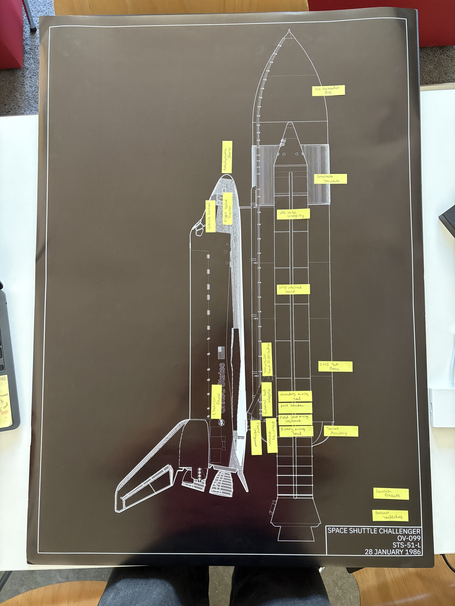
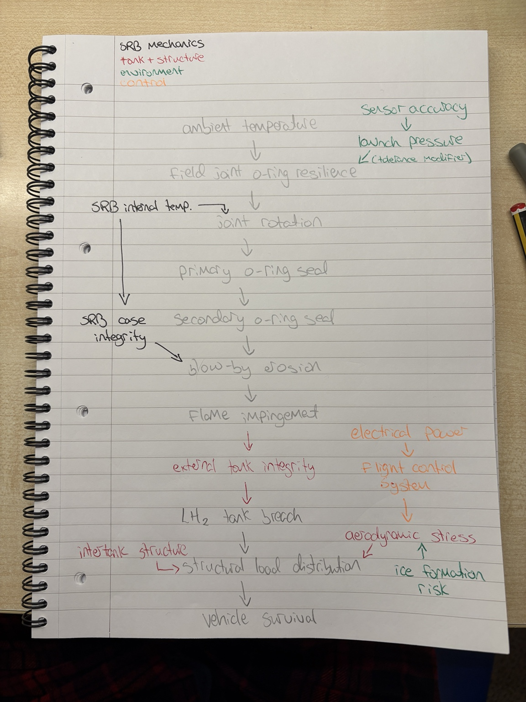
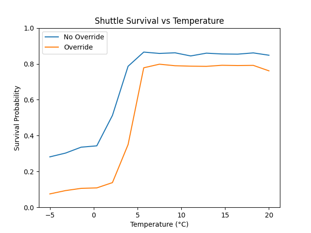
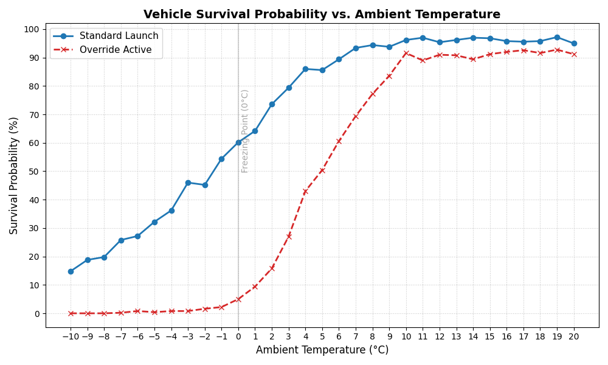

# Challenger Disaster — ESP32 LED Installation

A physical probabilistic simulation of the STS-51-L Space Shuttle Challenger failure cascade, mounted on an A1 foam board. Twenty individually addressed WS2812B LEDs represent the twenty modelled system nodes. Each LED transitions from green through amber to red as its corresponding component degrades, and fails to solid red when that component is lost. The simulation runs forward in time from ignition to T+73 seconds — the moment of vehicle breakup — governed by the physics, failure probabilities, and management decisions that caused the disaster.

---

## Table of Contents

1. [Project Overview](#1-project-overview)
2. [Historical Context](#2-historical-context)
3. [Hardware](#3-hardware)
4. [Wiring](#4-wiring)
5. [Node Map](#5-node-map)
6. [Simulation Model](#6-simulation-model)
7. [LED Behaviour](#7-led-behaviour)
8. [Configuration](#8-configuration)
9. [Deployment](#9-deployment)
10. [File Reference](#10-file-reference)

---

## 1. Project Overview

The installation presents the Challenger disaster as what it was: a probabilistic cascade of engineering failures compounded by an institutional decision to override safety concerns. Rather than a fixed replay of events, the simulation is stochastic — each run is a fresh roll of the underlying probability model. At warm temperatures with no override, the vehicle almost always survives. At -1°C with the launch commit override active, matching the actual 28 January 1986 conditions, loss of vehicle is highly probable but not guaranteed. This reflects the real situation: the engineers knew failure was likely; they were overruled.

The twenty nodes are laid out on the foam board in a schematic approximating the physical location of each system on the vehicle. Wiring runs on the back. The front shows only the LED holes.

---

## 2. Historical Context

### The Mission

STS-51-L launched on 28 January 1986 at 11:38 EST from Kennedy Space Center. Ambient temperature at launch was approximately -0.6°C (29°F), far below any previous Shuttle launch. The vehicle broke apart 73 seconds into flight, killing all seven crew members.

### The Cause

The Rogers Commission, convened by President Reagan and chaired by William P. Rogers, identified the cause as the failure of an O-ring seal in the right Solid Rocket Booster (SRB) field joint. At low temperatures, the rubber O-rings lose their elasticity and cannot seat properly against the joint surfaces when the SRB case expands at ignition.

The night before launch, engineers at Morton Thiokol — the SRB manufacturer — explicitly recommended against launching below 11.7°C (53°F). Their own resilience test data showed a steep non-linear drop in O-ring performance below this threshold. NASA management asked Thiokol to reconsider. Thiokol management overruled their own engineers and issued a launch recommendation. This decision is modelled directly in the simulation as the `override` flag.

### The Timeline

The simulation maps its 73 steps to the 73 seconds from ignition to breakup:

| Time | Event |
|------|-------|
| T+0s | SRB ignition. Cold O-rings fail to seat. Puffs of black smoke visible at the aft field joint. |
| T+0 to T+58s | Aluminium oxide slag from burning propellant temporarily seals the joint, masking the breach. |
| T+52s | Significant wind shear. Telemetry showed the vehicle yawing hard. Flight computers corrected, but the structural load increased. |
| T+58s | The slag seal begins to fail as aerodynamic heating increases. |
| T+60s | Maximum dynamic pressure (max-Q). The temporary seal breaks definitively. A plume of flame becomes visible on external camera footage. |
| T+64s | Flame impinges on the lower strut connecting the SRB to the External Tank. |
| T+72s | Lower strut fails. SRB rotates and strikes the intertank structure. |
| T+73s | External tank ruptures. Aerodynamic forces disintegrate the vehicle. The crew cabin separated intact and fell into the ocean. |

### The Override

The launch commit criteria required written documentation of any waiver. On the night of 27 January, this process was conducted by telephone, and Thiokol's final launch recommendation was transmitted without the dissenting engineers' objections formally recorded. This institutional suppression of engineering data is what the `LAUNCH_OVERRIDE = True` flag represents in the simulation.

---

## 3. Hardware

### Components

| Component | Specification | Notes |
|-----------|--------------|-------|
| Microcontroller | ESP32 (any standard dev board) | Runs MicroPython |
| LEDs | WS2812B individually addressed pixels | Cut from strip, rewired |
| Power supply | 5V 3A DC wall adapter | Barrel jack type, not mains-exposed |
| Decoupling capacitor | 1000µF electrolytic, 10V+ rated | Across 5V and GND at LED rail |
| Data resistor | 300–500Ω | In series on data line, first LED |
| Board | A1 foam board (841 × 594mm) | LEDs mounted through drilled holes |
| Wire | ~24 AWG solid-core hookup wire | Easier to route flat on board back |

### Why a Wall Adapter, Not a Mains PSU

A panel-mount mains supply (such as the Mean Well RS-15-5) requires the AC input terminals to be safely enclosed. On a foam board that will be handled, those terminals are exposed and the foam is flammable. A 5V 3A DC wall adapter keeps all mains circuitry sealed inside the plug, and the output is safe low-voltage DC. The Mean Well is excellent for enclosed panel builds, wrong for this application.

### Power Budget

Each WS2812B draws up to 60mA at full white (all three channels maximum). Twenty LEDs worst-case: 20 × 60mA = 1.2A. A 3A supply gives comfortable headroom for inrush and transients. The simulation never drives all LEDs to full white simultaneously, so average draw is considerably lower in practice.

### Logic Level

The ESP32 outputs 3.3V logic. WS2812Bs nominally expect a logic high of 0.7 × VDD = 3.5V. In most cases 3.3V works reliably. If flickering or data corruption occurs, add a 74AHCT125 logic level shifter between the ESP32 data pin and the first LED.

---

## 4. Wiring

### Power

```
Wall adapter (5V 3A)
    +V ──────────────────────────────── 5V bus rail (back of board)
    -V ──────────────────────────────── GND bus rail (back of board)

5V bus ──── tap ──── each LED 5V pad
GND bus ─── tap ──── each LED GND pad
ESP32 GND ─────────────────────────── GND bus rail  (common ground)
```

The ESP32 is powered separately (USB or its own 3.3V supply). Only GND is shared with the LED power rail. Never run LED power through the ESP32's 5V or 3.3V pins.

### Data Chain

```
ESP32 GPIO5 ── 300Ω resistor ── LED 0 DIN
                                LED 0 DOUT ── LED 1 DIN
                                              LED 1 DOUT ── LED 2 DIN
                                                            ... and so on
```

The data chain must follow the physical LED order on the board, which in turn must match the `NODE_NAMES` index order in the code. The order determines which node index maps to which LED. Plan the physical layout before drilling.

### Decoupling Capacitor

Place the 1000µF capacitor physically close to the LED strip power input, with the positive leg to 5V and negative to GND. This absorbs the sharp current spikes WS2812Bs produce at state transitions. Without it, voltage dips can corrupt the data signal.

---

## 5. Node Map

The twenty nodes are listed in index order. Each index corresponds to a physical LED on the board and a position in the `NODE_NAMES` list in the code. The layout on the board should approximate the physical location of each system on the vehicle, with the SRB corridor nodes clustered on the right (the right-hand SRB being the one that failed) and the external tank/structural nodes in the centre.



*Physical placement of each node on the A1 foam board. The SRB seal cluster (Field Joint through Blow-By) occupies a tight 3cm strip at the aft field joint on the right SRB. Exogenous environment nodes sit in the lower margin outside the vehicle outline.*

| Index | Node | System Location | Role in Cascade |
|-------|------|----------------|-----------------|
| 0 | Ambient Temperature | Environment | Drives O-ring resilience and ice risk. The root exogenous input. |
| 1 | Ice Formation Risk | Launch pad / vehicle exterior | Ice formed on the launch structure overnight. Contributes to aerodynamic stress if shed. |
| 2 | Sensor Accuracy | Instrumentation | Cold degrades sensor calibration, introducing noise into pressure readings. |
| 3 | Launch Pressure | SRB ignition system | Ramps through the ignition sequence. Feeds joint stress. |
| 4 | Field Joint O-Ring Resilience | Right SRB aft field joint | The primary failure node. Resilience is a direct non-linear function of ambient temperature via the Thiokol curve. |
| 5 | SRB Internal Temperature | Right SRB propellant | Cold propellant burns less uniformly, increasing joint dynamics and rotation. |
| 6 | Joint Rotation | Right SRB aft field joint | As the SRB case pressurises at ignition, the joint rotates. Cold, inelastic O-rings cannot follow this rotation. |
| 7 | Primary O-Ring Seal | Right SRB aft field joint | First line of seal. Fails to seat when joint rotation exceeds O-ring tracking capability. |
| 8 | Secondary O-Ring Seal | Right SRB aft field joint | Redundant seal, also compromised by cold and by the joint already being open when it is needed. |
| 9 | SRB Case Integrity | Right SRB casing | Treated as nominally healthy; contributes to blow-by only under compound failure. |
| 10 | Blow-By Erosion | Right SRB aft field joint | Hot combustion gas passing the failed O-ring seals, eroding the joint surface. Temporarily suppressed by the slag seal. |
| 11 | Flame Impingement | Right SRB exterior / ET strut | Blow-by escalates to a visible external flame plume impinging on the lower strut. |
| 12 | External Tank Integrity | ET lower attachment strut | The strut connecting the right SRB to the External Tank. Flame erodes and then severs it. |
| 13 | LH2 Tank Breach | External Tank lower dome | Once the strut fails, the SRB rotates into the ET, breaching the liquid hydrogen tank. |
| 14 | Intertank Structure | ET intertank section | Structural member between the LH2 and LOX tanks. Compromised when the rotating SRB strikes it. |
| 15 | Aerodynamic Stress | Vehicle as a whole | Dynamic pressure on the vehicle. Spiked at T+52s (wind shear) and T+60s (max-Q). |
| 16 | Structural Load Distribution | Vehicle primary structure | Integrates LH2 breach, intertank damage, and aerodynamic stress. Failure here means structural breakup. |
| 17 | Electrical Power | Vehicle power systems | Nominally stable; minor degradation under sustained ignition pressure. |
| 18 | Flight Control System | Vehicle avionics | Dependent on electrical power. Stressed by wind shear. |
| 19 | Vehicle Survival | Entire vehicle | Terminal node. Failure ends the simulation. |

---

## 6. Simulation Model

### Architecture

The simulation is a directed probabilistic graph. Each node has a health value between 0.0 and 1.0, a baseline failure probability parameter, and a set of directed edges from parent nodes. At each time step, every non-exogenous node computes a failure probability from its current health and the weighted stress from its parents, then draws against that probability.



*The full directed dependency graph. Grey = SRB mechanics chain. Red = tank and structure. Green = environment. Orange = control systems. The chain from Field Joint O-Ring Resilience through to Vehicle Survival is the primary failure corridor.*

### Exogenous Nodes

Eight nodes are driven directly by physics rather than the propagation model: `Ambient Temperature`, `Ice Formation Risk`, `Sensor Accuracy`, `Launch Pressure`, `SRB Internal Temperature`, `SRB Case Integrity`, `Intertank Structure`, and `Electrical Power`. Their values are set analytically each step.

### O-Ring Temperature Curve

The original linear model in `main.py` understated the severity of the temperature effect. The Rogers Commission's analysis, drawing on Thiokol's own resilience test data, showed that O-ring resilience is approximately zero below 0°C and drops steeply between 0°C and 12°C. This is modelled by:

```python
def oring_resilience(temp_c):
    return max(0.0, min(1.0, sigmoid((temp_c - 10.0) * 0.55)))
```

The sigmoid is centred at 10°C (50°F), matching Thiokol's identified minimum safe temperature. At -1°C (actual launch temperature), this returns approximately 0.006 — near-zero resilience. At 20°C, it returns approximately 0.99. The original linear model at -1°C returned approximately 0.93, which was substantially too optimistic.

### Weighted Stress Propagation

Each node receives stress from its parents proportional to their health degradation, weighted by edge coefficients. Heavier weights on the SRB-to-ET failure path (blow-by → flame → external tank → LH2 breach) reflect that once this chain initiates, propagation is rapid and near-certain. Lighter weights on auxiliary paths (sensor → pressure, power → flight control) reflect that these subsystems degraded but were not themselves causal.

```python
stress = sum(edge_w.get((dep, node.name), 1.0) * (1.0 - nodes[dep].health)
             for dep in node.dependencies)
```

If any parent has hard-failed, an additional random shock between 2.2 and 3.2 is applied, plus a small probabilistic chance of immediate failure regardless of the logit.

### Failure Probability

```python
logit = baseline + health_sensitivity * (1.0 - health) + stress + override_term
p_fail = sigmoid(logit)
```

The baseline is tuned per-node to reflect prior failure probability under nominal conditions. The health sensitivity term means a degraded node is easier to push over the threshold. The override term adds penalty to SRB corridor nodes when the launch commit override is active.

### The Slag Seal

At ignition, the failing O-rings allow combustion gas blow-by. However, aluminium oxide slag from the burning propellant initially plugs this gap, temporarily suppressing the leak. This is visible in launch footage as puffs of black smoke at ignition followed by apparent cessation of the anomaly. The simulation models this as a suppression window:

- **Activation:** When `Primary O-Ring Seal` has failed but `Blow-By Erosion` has not yet propagated, the slag seal activates.
- **Effect:** While active, `Blow-By Erosion` is excluded from the propagation update — it cannot progress regardless of parent stress.
- **Termination:** At T+60 (max-Q), the seal is forcibly broken and `Blow-By Erosion` is set to failed immediately, reflecting the observation that the plume reappeared definitively at this point in the real flight.

This produces the characteristic false-hope window in simulation runs: the SRB corridor nodes degrade and the O-ring seals may fail, but the cascade stalls for several seconds before max-Q triggers the definitive breach.

### Timed Events

```python
# T+52: wind shear
nodes['Aerodynamic Stress'].health    *= 0.55
nodes['Flight Control System'].health *= 0.80

# T+60: max-Q + slag seal break
slag['broken'] = True
nodes['Blow-By Erosion'].failed = True
nodes['Aerodynamic Stress'].health          *= 0.60
nodes['Structural Load Distribution'].health *= 0.85
```

These are deterministic spikes applied at fixed timesteps. The magnitudes are tuned to produce realistic survival probability curves across the temperature range.

### Override Flag

When `LAUNCH_OVERRIDE = True`, each SRB corridor node receives an additive penalty to its failure logit. The values are:

| Node | Override Penalty |
|------|-----------------|
| Field Joint O-Ring Resilience | +2.8 |
| Primary O-Ring Seal | +1.2 |
| Secondary O-Ring Seal | +1.2 |
| Blow-By Erosion | +0.8 |
| Flame Impingement | +0.6 |

The field joint takes the largest penalty because this is exactly the system Thiokol engineers warned about and management chose to ignore.



*Monte Carlo survival rates across the temperature range. Without override, the vehicle has a reasonable chance of survival down to around 2°C. With override active, survival probability collapses below ~5°C and is near-zero at the actual launch temperature of -1°C. The gap between the two lines is the quantified cost of the management decision.*

### Survival Probability by Temperature

Approximate survival rates from Monte Carlo runs (1000 simulations per condition):

| Temperature | Override Off | Override On |
|------------|-------------|-------------|
| +15°C | ~99% | ~85% |
| +10°C | ~90% | ~55% |
| +5°C | ~65% | ~20% |
| 0°C | ~25% | ~5% |
| -1°C (actual) | ~18% | ~3% |



*Full survival probability curve from `simulator.py` across the -10°C to +20°C range. The steep drop between 0°C and 5°C corresponds directly to the O-ring resilience sigmoid. The actual launch temperature of -1°C sits on the near-zero section of the override curve.*

---

## 7. LED Behaviour

### Colour Scheme

Colour is determined by a two-segment linear interpolation across the health range, with brightness also scaling with health:

| State | Colour | Meaning |
|-------|--------|---------|
| Health 1.0–0.5 | Green fading to amber | System nominal to marginal |
| Health 0.5–0.0 | Amber fading to red, dimming | System degrading toward failure |
| Failed | Solid bright red | Component lost |
| Override active | Blue | SRB corridor node under override penalty |

```python
if h >= 0.5:
    t = (1.0 - h) * 2.0
    r = lerp(0, 255, t)
    g = lerp(180, 110, t)
else:
    t = (0.5 - h) * 2.0
    r = 255
    g = lerp(110, 0, t)
brightness = max(0.25, h)
```

The minimum brightness floor of 0.25 ensures a critically degraded node remains visible rather than going dark before it fully fails.

### Sequences

**Boot sequence:** On startup, LEDs illuminate sequentially from index 0 to 19 in green, simulating a pre-launch system readiness check. Takes approximately 1.6 seconds.

**Simulation:** Each step updates node states and writes all LEDs. At the configured 400ms per step, the full 73-step run takes approximately 29 seconds.

**Outcome flash:** On completion, all LEDs flash six times — green for vehicle survival, red for loss of vehicle. On loss of vehicle, the board holds a dim red after the flash sequence.

---

## 8. Configuration

All configuration is at the bottom of `challenger_esp32.py`:

```python
LED_PIN         = 5      # GPIO pin connected to LED data line
NUM_LEDS        = 20
STEP_DELAY_MS   = 400    # ms per simulation step

LAUNCH_TEMP_C   = -1     # actual Challenger launch temperature
LAUNCH_OVERRIDE = True   # management override of Thiokol recommendation
```

To simulate a nominal warm-weather launch:
```python
LAUNCH_TEMP_C   = 15
LAUNCH_OVERRIDE = False
```

To explore the threshold region:
```python
LAUNCH_TEMP_C   = 8
LAUNCH_OVERRIDE = False
```

Increasing `STEP_DELAY_MS` slows the display for presentations. At 1000ms per step, the full run takes about 73 seconds, matching real time.

---

## 9. Deployment

### Requirements

- ESP32 flashed with MicroPython (v1.20 or later recommended)
- `mpremote` or Thonny for file transfer

### Flash MicroPython

Download the correct `.bin` for your ESP32 variant from [micropython.org/download](https://micropython.org/download/ESP32_GENERIC/).

```bash
pip install esptool
esptool.py --chip esp32 erase_flash
esptool.py --chip esp32 --baud 460800 write_flash -z 0x1000 ESP32_GENERIC-*.bin
```

### Transfer the Script

```bash
pip install mpremote
mpremote connect /dev/tty.usbserial-* cp challenger_esp32.py :main.py
```

Saving as `main.py` on the device means it runs automatically on power-up.

### Verify

```bash
mpremote connect /dev/tty.usbserial-* repl
# then hard reset the board -- you should see the boot sequence immediately
```

### Troubleshooting

| Symptom | Likely cause | Fix |
|---------|-------------|-----|
| LEDs flicker or show wrong colours | Logic level mismatch | Add 74AHCT125 level shifter on data line |
| First LED works, rest don't | Bad solder joint on first DOUT pad | Reflow the DIN pad of LED 1 |
| All LEDs off | Data resistor too high, or wrong GPIO | Try a lower resistor value; confirm `LED_PIN` matches wiring |
| Board resets mid-sequence | Insufficient power supply | Ensure supply is rated 3A minimum; check capacitor is present |
| Script doesn't start on boot | File saved as wrong name | Must be saved as `main.py` on the device |

---

## 10. File Reference

| File | Description |
|------|-------------|
| `challenger_esp32.py` | MicroPython source for the ESP32. Copy to device as `main.py`. |
| `main.py` | Original Python simulation with weighted edge model. Run on desktop for statistical analysis. |
| `simulator.py` | Earlier simulation version with terminal mission control feed and matplotlib survival curves. |

---

## References

- Rogers Commission Report (1986). *Report of the Presidential Commission on the Space Shuttle Challenger Accident*. NASA.
- Feynman, R.P. (1986). Personal appendix to the Rogers Commission Report. Includes the O-ring ice water demonstration and the observation that NASA management had been operating with a factor-of-1000 optimism bias on failure probability.
- McDonald, A.J. & Hansen, J.R. (2009). *Truth, Lies, and O-Rings: Inside the Space Shuttle Challenger Disaster*. University Press of Florida.
- Vaughan, D. (1996). *The Challenger Launch Decision: Risky Technology, Culture, and Deviance at NASA*. University of Chicago Press. The sociological account of how the normalisation of deviance made the launch decision possible.